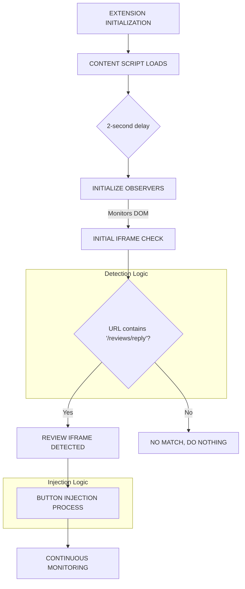

# **Complete Analysis: Chrome Extension Iframe Detection & Button Injection System for Google Reviews**

## **1. APPLICATION OVERVIEW**

This Chrome extension is designed to detect the Google Business Profile **review response iframe** and inject an AI-powered button for automated content generation.

## **2. IFRAME DETECTION SYSTEM - DETAILED BREAKDOWN**

### **Introduction: The Detection Process Explained**

The extension discovers that the review iframe is active through a dynamic, three-part process: **continuous observation, URL analysis, and pattern matching**. It doesn't just check the URL once upon loading; it actively listens for any navigation or content changes that happen on the page, which is essential for modern single-page applications like the Google Business Profile manager.

The key components driving this are:
1.  A **`MutationObserver`**: This is the primary listener. Think of it as a vigilant lookout that the extension places on the page's structure (the DOM). It's configured to immediately report any changes, such as new content being loaded.
2.  **URL Change Tracking**: The `MutationObserver`'s callback function is specifically coded to check the browser's current URL (`window.location.href`) every time a change happens. By comparing the new URL to the last known URL, it can detect when the user navigates to a new section, even without a full page reload.
3.  **A Central Configuration File (`config.js`)**: This file acts as the extension's brain. It contains a unique URL snippet (`urlPart`) that acts as a "signature" for the target iframe. It knows that any URL containing `/customers/reviews/reply` belongs to the "Single Review" iframe.
4.  **The Orchestrator Function (`handleIframe`)**: When the `MutationObserver` reports a change, this function takes the new URL, passes it to a detection function for pattern matching against the known signature, and if a match is found, it kicks off the appropriate action (injecting a button).

In short, the extension keeps a constant watch on the page. The moment the URL or content changes, it analyzes the new URL, matches it to its list of known iframe signatures, and instantly knows it's time to act.

### **2.1 Core Detection Configuration**

The iframe detection is centralized in `src/config/config.js`:

```javascript
IFRAME_TYPES: {
  SINGLEREVIEW: {
    urlPart: '/customers/reviews/reply',
    buttonText: 'Respond with AI',
    containerSelector: 'div.FkJOzc.lgfhc.LW6Hp',
    referenceButtonSelector: 'button[jsname="hrGhad"]',
    textAreaJsName: 'YPqjbf'
  }
}
```

### **2.2 URL Pattern Detection Function**

**`src/content/content.js`**
```javascript
function detectIframeType(url) {
  console.log('Detecting iframe type for URL:', url);
  // The configuration now only contains SINGLEREVIEW
  for (const [type, config] of Object.entries(IFRAME_TYPES)) {
    if (url.includes(config.urlPart)) {
      console.log(`Detected iframe type: ${type} for URL: ${url}`);
      return type;
    }
  }
  console.log(`No matching iframe type found for URL: ${url}`);
  return null;
}
```

**Detection Logic:**
- Iterates through the single `SINGLEREVIEW` configuration.
- Uses `String.includes()` to match if the URL contains `/customers/reviews/reply`.
- Returns `SINGLEREVIEW` if it matches, otherwise returns `null`.

### **2.3 DOM Element Selectors**

The extension uses highly specific CSS selectors defined in the configuration, relevant only to the review iframe:

```javascript
SELECTORS: {
  SINGLE_REVIEW_CONTAINERS: '.HRSRcc .noyJyc',
  REVIEWER_NAME: 'a[jsname="xs1xe"], .N0c6q.JhRJje a',
  STAR_RATING: '.DYizzd',
  REVIEW_TEXT: '.gyKkFe.JhRJje',
  RESPONDER_BUTTON: 'button[jsname="hrGhad"]',
  TEXTAREA: 'textarea[jsname="YPqjbf"]',
  REVIEW_CONTAINERS: '.HRSRcc .noyJyc',
  FOOTER: 'footer.qYDdsb.raRhrb.XHUDdsb.JhRJje.vG9efb.Is5Vhc',
  CONTAINER: 'div.FkJOzc',
  REFERENCE_BUTTON: 'button.VfPpkd-LgbsSe.VfPpkd-LgbsSe-OWXEXe-k8QpJ.VfPpkd-LgbsSe-OWXEXe-dgl2Hf.nCP5yc.AjY5Oe.DuMIQc.LQeN7.FwaX8'
}
```

## **3. IFRAME DETECTION FLOW**

### **3.1 Initialization Sequence**

**`src/content/content.js`**
```javascript
function initializeWithDelay() {
    console.log('Initializing with delay...');
    setTimeout(() => {
        console.log('Delayed initialization starting...');
        initializeObservers();
        handleIframe(window.location.href);
    }, 2000); // 2 second delay
}

// Call this function instead of directly calling initializeObservers
initializeWithDelay();
```

**Flow Steps:**
1.  **Content script loads** → Logs current URL
2.  **2-second delay** → Allows page to fully render
3.  **Initialize observers** → Sets up DOM monitoring
4.  **Initial iframe check** → Processes current URL

### **3.2 MutationObserver Setup**

**`src/content/content.js`**
```javascript
function initializeObservers() {
  if (observersInitialized) return; // Skip if already initialized

  const targetNode = document.querySelector(SELECTORS.FOOTER) || document.body;
  const config = { childList: true, subtree: true };

  let lastUrl = window.location.href;

  const observer = new MutationObserver(adaptiveDebounce((mutations) => {
    const currentUrl = window.location.href;
    if (currentUrl !== lastUrl) {
      console.log(`URL changed. Current URL: ${currentUrl}`);
      lastUrl = currentUrl;
      resetButtonInjectedState();
      handleIframe(currentUrl);
    } else if (mutations.some(mutation => mutation.addedNodes.length > 0)) {
      console.log('Content changed, checking for button injection');
      handleIframe(currentUrl);
    }
  }, CONFIG.WAIT.DEBOUNCE));

  observer.observe(targetNode, config);
  observersInitialized = true;
  console.log('Observers initialized and watching for URL and content changes');
}
```

**Observer Configuration:**
- **Target Node:** Footer element or document.body as fallback
- **Config:** `{ childList: true, subtree: true }` - monitors all child additions/removals
- **Debouncing:** Uses adaptive debouncing (300ms default) to prevent excessive calls
- **Triggers:** URL changes OR new DOM nodes added

### **3.3 Adaptive Debouncing System**

**`src/content/content.js`**
```javascript
function adaptiveDebounce(func, initialWait = CONFIG.WAIT.DEBOUNCE, activityThreshold = 5) {
  let timeout;
  let activityCount = 0;
  let currentWait = initialWait;

  return function (...args) {
    activityCount++;

    // Adjust debounce delay based on activity
    if (activityCount > activityThreshold) {
      currentWait = Math.max(initialWait / 2, 50); // Example: reduce delay but not below 50ms
    } else {
      currentWait = initialWait;
    }

    const later = () => {
      clearTimeout(timeout);
      activityCount = 0; // Reset after executing
      func(...args);
    };

    clearTimeout(timeout);
    timeout = setTimeout(later, currentWait);
  };
}
```

**Adaptive Logic:**
- **Low Activity:** Uses full debounce delay (300ms)
- **High Activity:** Reduces delay to 50ms minimum
- **Activity Threshold:** 5 calls triggers faster response
- **Reset:** Activity count resets after execution

## **4. BUTTON INJECTION SYSTEM**

### **4.1 Main Iframe Handler**

**`src/content/content.js`**
```javascript
async function handleIframe(url) {
  resetButtonInjectedState(); // Reset the state when handling a new iframe
  const iframeType = detectIframeType(url);
  if (!iframeType) { // Will only proceed if iframeType is 'SINGLEREVIEW'
    console.log('Not in a review iframe, skipping button injection');
    return;
  }

  console.log(`${iframeType} iframe detected, starting button injection process`);
  const config = IFRAME_TYPES[iframeType];
  const clickHandler = clickHandlers[iframeType];

  if (!clickHandler) {
    console.error(`No click handler found for ${iframeType}`);
    return;
  }

  const injected = await injectButtonWithRetry(config.buttonText, clickHandler, iframeType);
  console.log(`Button injection result for ${iframeType}:`, injected);
}
```

### **4.2 Button Creation Function**

**`src/content/content.js`**
```javascript
function createAIButton(buttonText, iframeType) {
  const button = document.createElement('button');
  button.className = 'ai-inject-button VfPpkd-LgbsSe VfPpkd-LgbsSe-OWXEXe-k8QpJ VfPpkd-LgbsSe-OWXEXe-dgl2Hf nCP5yc AjY5Oe LQeN7 TUT4y';
  button.innerHTML = `
    <div class="VfPpkd-Jh9lGc"></div>
    <div class="VfPpkd-J1Ukfc-LhBDec"></div>
    <div class="VfPpkd-RLmnJb"></div>
    <span class="VfPpkd-vQzf8d">${buttonText}</span>
  `;
  button.setAttribute('data-injected', 'true');
  button.setAttribute('data-iframe-type', iframeType);
  return button;
}
```

**Button Structure:**
- **Classes:** Mimics Google's Material Design button styling
- **Inner HTML:** Follows Google's button component structure
- **Attributes:**
  - `data-injected="true"` - Marks as extension-created
  - `data-iframe-type="SINGLEREVIEW"` - Identifies it as the review button

### **4.3 Button Injection Logic**

**`src/content/content.js`**
```javascript
async function injectButton(buttonText, onClickHandler, iframeType) {
  if (buttonInjected) {
    console.log(`Button already injected for ${iframeType}`);
    return true;
  }

  console.log(`Attempting to inject button for ${iframeType}`);
  const userLoggedIn = await isUserLoggedIn();
  if (!userLoggedIn) {
    console.log('User is not logged in. Skipping button injection.');
    return false;
  }

  const container = document.querySelector(SELECTORS.CONTAINER);
  if (!container) {
    console.log(`Container not found for ${iframeType}`);
    return false;
  }

  const existingButton = container.querySelector(`.ai-inject-button[data-iframe-type="${iframeType}"]`);
  if (existingButton) {
    console.log(`AI button already exists for ${iframeType}`);
    buttonInjected = true;
    return true;
  }

  const referenceButton = container.querySelector(SELECTORS.REFERENCE_BUTTON);
  if (!referenceButton) {
    console.log(`Reference button not found for ${iframeType}`);
    return false;
  }

  const newButton = createAIButton(buttonText, iframeType);
  newButton.addEventListener('click', (event) => {
    onClickHandler(event, container);
  });

  referenceButton.parentNode.insertBefore(newButton, referenceButton.nextSibling);

  console.log(`${buttonText} button added successfully for ${iframeType}`);
  buttonInjected = true;
  return true;
}
```

**Injection Prerequisites:**
1.  **Not already injected** - Prevents duplicates
2.  **User logged in** - Authentication check
3.  **Container exists** - Target DOM element found
4.  **No existing button** - Prevents multiple injections
5.  **Reference button exists** - Insertion point available

**Injection Process:**
1.  Create button element
2.  Attach click event handler
3.  Insert after reference button
4.  Mark as injected

### **4.4 Retry Mechanism**

**`src/content/content.js`**
```javascript
async function injectButtonWithRetry(buttonText, onClickHandler, iframeType, maxRetries = 5, delay = 1000) {
  for (let i = 0; i < maxRetries; i++) {
    const injected = await injectButton(buttonText, onClickHandler, iframeType);
    if (injected) {
      console.log(`Button successfully injected for ${iframeType}`);
      return true;
    }
    await new Promise(resolve => setTimeout(resolve, delay));
  }
  console.error(`Failed to inject button for ${iframeType} after ${maxRetries} attempts`);
  return false;
}
```

**Retry Configuration:**
- **Max Retries:** 5 attempts
- **Delay:** 1000ms between attempts
- **Success:** Returns on first successful injection
- **Failure:** Logs error after all attempts fail

## **5. CLICK HANDLER SYSTEM**

### **5.1 Handler Mapping**

**`src/content/content.js`**
```javascript
const clickHandlers = {
    SINGLEREVIEW: handleReviewAction
};
```

### **5.2 Review Handler**

**`src/content/content.js`**
```javascript
async function handleReviewAction(event) {
  try {
    resetButtonInjectedState(); // Reset the state when handling a new review
    incrementReviewCount();

    await checkAndLoadCompanyProfile(); // Lazy load profile check

    const reviewContainer = await waitForElement(SELECTORS.SINGLE_REVIEW_CONTAINERS);
    if (!reviewContainer) {
      console.error('Review container not found');
      return;
    }

    const reviewerName = getElementTextContent(reviewContainer, SELECTORS.REVIEWER_NAME);
    const starRating = getStarRating(reviewContainer, SELECTORS.STAR_RATING);
    const reviewText = getElementTextContent(reviewContainer, SELECTORS.REVIEW_TEXT);

    const textArea = await waitForElement([SELECTORS.TEXTAREA], 30, 200, reviewContainer.closest('.HRSRcc'));

    if (textArea) {
      const prompt = await getReviewPrompt(starRating);
      const aiResponse = await generateAIResponse(prompt, reviewerName, starRating, reviewText);
      updateTextArea(aiResponse, textArea);
    } else {
      console.error('Text area not found');
    }
  } catch (error) {
    console.error('Error in handleReviewAction:', error);
    // Consider showing a user-friendly error message here
  }
}
```

**Review Handler Process:**
1.  **Reset state** - Prepare for new review
2.  **Increment counter** - Track usage statistics
3.  **Load profile** - Get company configuration
4.  **Extract review data** - Name, rating, text
5.  **Wait for textarea** - Ensure target element exists
6.  **Generate response** - Call OpenAI API
7.  **Update textarea** - Insert generated content

## **6. BACKGROUND SCRIPT COORDINATION**

### **6.1 Tab Update Listener**

**`src/background/background.js`**
```javascript
chrome.tabs.onUpdated.addListener((tabId, changeInfo, tab) => {
  if (changeInfo.status === 'complete') {
    console.log("Page loaded:", tab.url);
    // Check if the content script is ready before sending the message
    checkContentScriptReady(tabId, tab.url);
  }
});
```

### **6.2 Content Script Readiness Check**

**`src/background/background.js`**
```javascript
function checkContentScriptReady(tabId, url) {
  chrome.tabs.sendMessage(tabid, { action: "isContentScriptReady" }, (response) => {
    if (chrome.runtime.lastError) {
      console.log("Content script not ready yet. Waiting...");
      // Set up a retry mechanism
      setTimeout(() => checkContentScriptReady(tabId, url), 1000);
    } else {
      // Content script is ready, send the actual message
      chrome.tabs.sendMessage(tabId, { action: "checkIframe", url: url }, (response) => {
        if (chrome.runtime.lastError) {
          console.error("Error sending message:", chrome.runtime.lastError);
        } else if (response) {
          console.log("Response from content script:", response);
        }
      });
    }
  });
}
```

## **7. COMPLETE DETECTION FLOW DIAGRAM**



## **8. JUNIOR DEVELOPER GUIDE: IMPLEMENTING REVIEW IFRAME DETECTION**

### **8.1 Basic Setup**

```javascript
// 1. Define your iframe type and URL pattern in a config file
const IFRAME_TYPES = {
  SINGLEREVIEW: {
    urlPart: '/customers/reviews/reply',
    buttonText: 'Respond with AI',
    containerSelector: 'div.FkJOzc',
    referenceButtonSelector: 'button.VfPpkd-LgbsSe[jsname="hrGhad"]'
  }
};

// 2. Create detection function
function detectIframeType(url) {
  const reviewConfig = IFRAME_TYPES.SINGLEREVIEW;
  if (url.includes(reviewConfig.urlPart)) {
    return 'SINGLEREVIEW';
  }
  return null;
}
```

### **8.2 DOM Monitoring Setup**

```javascript
// 3. Set up MutationObserver
function initializeObservers() {
  const observer = new MutationObserver(debounce((mutations) => {
    const currentUrl = window.location.href;

    // Check for URL changes or new content
    if (currentUrl !== lastUrl ||
        mutations.some(mutation => mutation.addedNodes.length > 0)) {
      lastUrl = currentUrl;
      handleIframe(currentUrl);
    }
  }, 300)); // 300ms debounce

  observer.observe(document.body, {
    childList: true,
    subtree: true
  });
}

// 4. Debounce function to prevent excessive calls
function debounce(func, wait) {
  let timeout;
  return function executedFunction(...args) {
    const later = () => {
      clearTimeout(timeout);
      func(...args);
    };
    clearTimeout(timeout);
    timeout = setTimeout(later, wait);
  };
}
```

### **8.3 Button Injection Implementation**

```javascript
// 5. Main iframe handler
async function handleIframe(url) {
  const iframeType = detectIframeType(url);
  if (iframeType !== 'SINGLEREVIEW') return;

  const config = IFRAME_TYPES.SINGLEREVIEW;
  await injectButton(config.buttonText, handleReviewAction, iframeType);
}

// 6. Button injection with retry logic
async function injectButton(buttonText, clickHandler, iframeType, maxRetries = 5) {
  for (let i = 0; i < maxRetries; i++) {
    // Find container
    const container = document.querySelector(IFRAME_TYPES[iframeType].containerSelector);
    if (!container) {
      await new Promise(resolve => setTimeout(resolve, 1000));
      continue;
    }

    // Check for existing button
    const existingButton = container.querySelector(`[data-iframe-type="${iframeType}"]`);
    if (existingButton) return true;

    // Find reference button for insertion
    const referenceButton = container.querySelector(IFRAME_TYPES[iframeType].referenceButtonSelector);
    if (!referenceButton) {
      await new Promise(resolve => setTimeout(resolve, 1000));
      continue;
    }

    // Create and inject button
    const button = createButton(buttonText, iframeType);
    button.addEventListener('click', clickHandler);
    referenceButton.parentNode.insertBefore(button, referenceButton.nextSibling);

    return true;
  }
  return false;
}

// 7. Button creation
function createButton(text, iframeType) {
  const button = document.createElement('button');
  button.textContent = text;
  button.setAttribute('data-iframe-type', iframeType);
  button.className = 'your-button-classes'; // Use classes that match the target site
  return button;
}
```

### **8.4 Essential Selectors to Identify for Reviews**

1.  **URL Pattern**: `/customers/reviews/reply`
2.  **Container Selector**: A parent element that holds the reply form and buttons. Example: `div.FkJOzc`
3.  **Reference Button**: The existing "Send" or "Reply" button to position your button next to. Example: `button[jsname="hrGhad"]`
4.  **Target Elements**: The `textarea` for the reply, the reviewer's name, star rating, and original review text.

**Example identification process:**
```javascript
// Open browser dev tools on the review reply page
// 1. Confirm the URL contains '/customers/reviews/reply'
console.log(window.location.href);

// 2. Find the container element that holds the reply box and buttons
// Right-click near the reply box → Inspect

// 3. Find the 'Send' button and get a stable selector for it

// 4. Find the textarea and other review-specific elements
// Test selectors in console: document.querySelector('textarea[jsname="YPqjbf"]')
```

### **8.5 Testing Your Implementation**

```javascript
// Add logging for debugging
function detectIframeType(url) {
  console.log('Testing URL:', url);
  const reviewConfig = IFRAME_TYPES.SINGLEREVIEW;
  if (url.includes(reviewConfig.urlPart)) {
    console.log(`✅ Match found: SINGLEREVIEW`);
    return 'SINGLEREVIEW';
  }
  console.log('❌ No review iframe match');
  return null;
}

// Test selectors
function testSelectors() {
  const config = IFRAME_TYPES.SINGLEREVIEW;
  console.log(`Testing selectors for SINGLEREVIEW:`);
  console.log('Container:', document.querySelector(config.containerSelector));
  console.log('Reference:', document.querySelector(config.referenceButtonSelector));
}
```

### **8.6 Common Pitfalls to Avoid**

1.  **Timing Issues** - Always use retry logic and wait for elements to appear, as SPAs render content dynamically.
2.  **Selector Brittleness** - Google often uses generated class names. Prefer selectors based on stable attributes like `jsname`, `aria-label`, or roles.
3.  **Duplicate Injection** - Always check if your button has already been added before injecting a new one.
4.  **Memory Leaks** - If you create observers or listeners that are no longer needed, make sure to disconnect them.
5.  **SPA Navigation** - Your logic must handle URL changes without a full page reload, which the `MutationObserver` setup does correctly.

### **8.7 Advanced Features**

```javascript
// Adaptive debouncing for better performance
function adaptiveDebounce(func, initialWait = 300, activityThreshold = 5) {
  let timeout, activityCount = 0, currentWait = initialWait;

  return function (...args) {
    activityCount++;
    currentWait = activityCount > activityThreshold ?
      Math.max(initialWait / 2, 50) : initialWait;

    clearTimeout(timeout);
    timeout = setTimeout(() => {
      activityCount = 0;
      func(...args);
    }, currentWait);
  };
}

// Element waiting utility
function waitForElement(selector, timeout = 10000) {
  return new Promise((resolve, reject) => {
    const startTime = Date.now();
    const checkElement = () => {
      const element = document.querySelector(selector);
      if (element) {
        resolve(element);
      } else if (Date.now() - startTime > timeout) {
        reject(new Error(`Element ${selector} not found within ${timeout}ms`));
      } else {
        setTimeout(checkElement, 100);
      }
    };
    checkElement();
  });
}
```

This comprehensive guide provides everything needed to implement a robust iframe detection and button injection system for Google Reviews. The key is understanding the URL patterns, DOM structure, and timing considerations specific to the target application.
